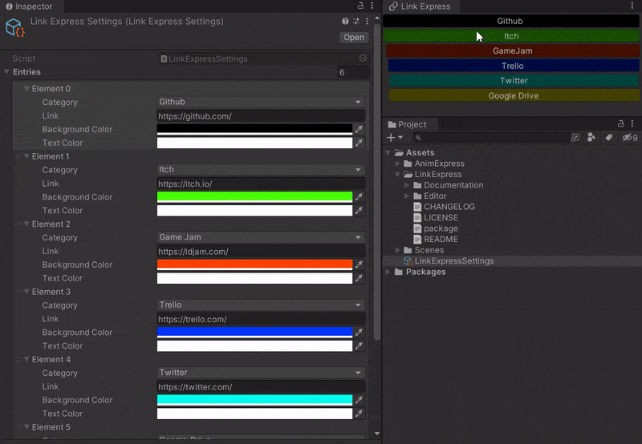
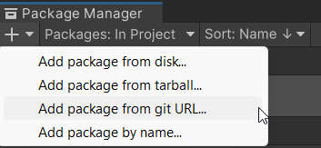
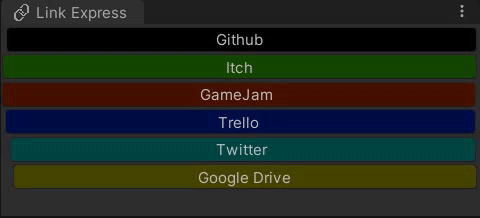

<div align="center">

# Link-Express
[](https://unity3d.com/get-unity/download)
[](https://github.com/sgaumin/AnimExpress/blob/main/LICENSE.md)

**Lightweight Unity Utility to quickly access useful external links from Unity**

[Demo](#demo) •
[Installation](#installation) •
[Setup](#setup) •
[Support](#support) •
[Animations](#animations) •
[License](#license)

</div>

## Demo
<p align="center">
  
</p>

## Installation
You can install this library by the steps below.

1. Select **Window > Package Manager** from the menu bar.
2. Click the **+** button in the upper left corner of the window and select **Add package from git URL...**.
3. Enter the following URL in the input field and click **Add**.

```
https://github.com/sgaumin/LinkExpress.git
```

<p align="center">
  
</p>


## Setup

### Opening
Open the window from **Tool > LinkExpress**.

### Configuration
Button types and links can be setup under **Player Settings > Link Express** tab.

## Animations
Link Express comes with color and movement animations by default. These can be deactivated from the configuration page. 

<p align="center">
  
</p>

## Support

If you ever come across any issues please feel free to report to the [Issues](https://github.com/sgaumin/LinkExpress/issues) page on this repository. All feedback is appreciated, and will be
taken on board for any future updates. 

## License

[MIT License](https://github.com/sgaumin/LinkExpress/blob/main/LICENSE.md)
